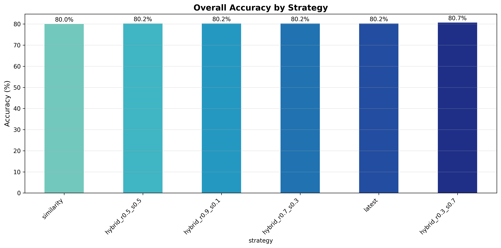
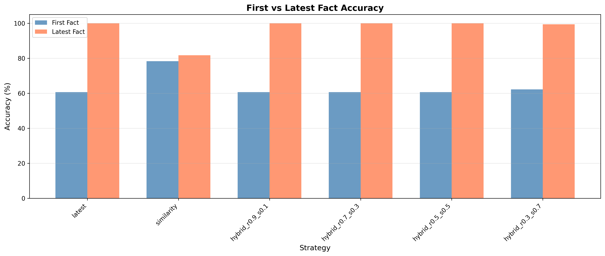
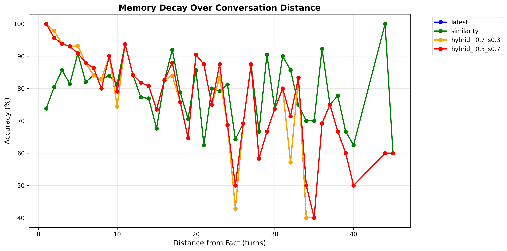
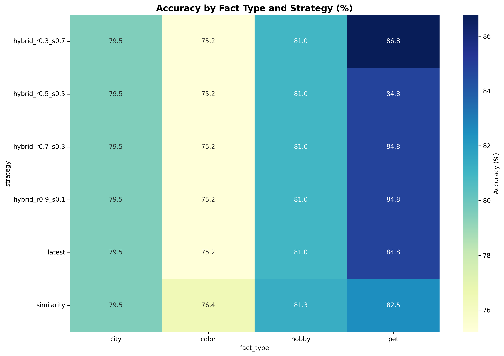
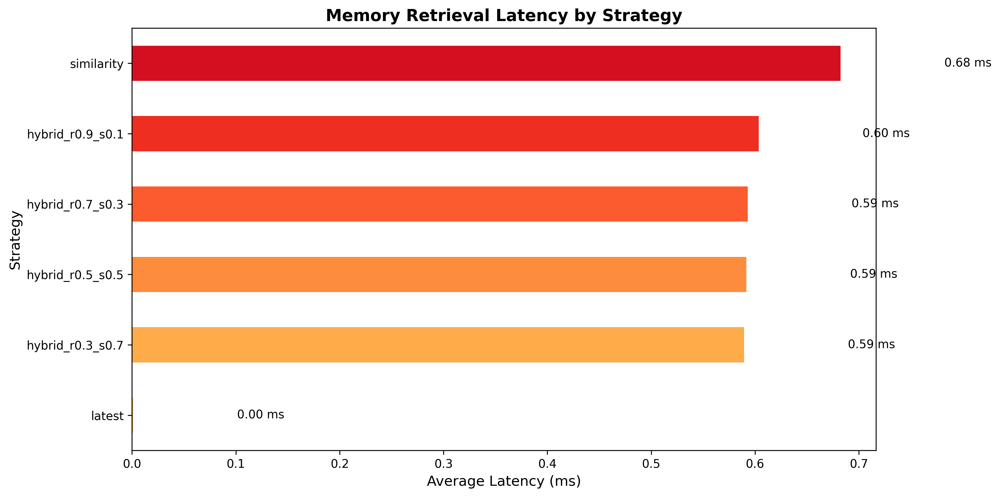
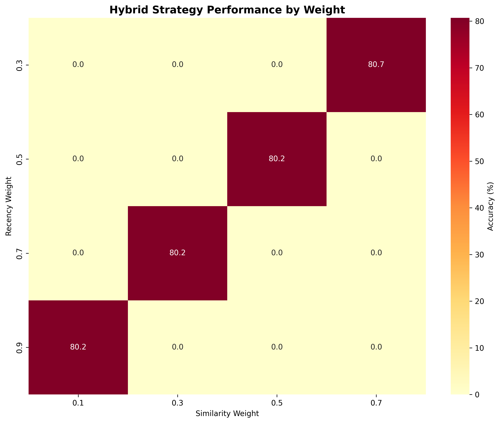

# 🧠 Conversational AI Memory Benchmark – Phase 1

**Author:** Meryem AIT MOUT  
**Year:** 2026

[](https://opensource.org/licenses/MIT)
[](https://www.python.org/downloads/)

## Overview

This repository contains the complete code, data, and analysis for **Phase 1** of my conversational AI memory benchmark research. This project systematically investigates how different memory strategies perform in conversational AI through controlled experiments with **6,000 fact-retrieval attempts**.

### Key Research Questions

1. **Memory Strategy Comparison**: How do recency-based, similarity-based, and hybrid strategies compare?
2. **Fact Type Effects**: Does content modulate memorability?
3. **Memory Decay**: How does accuracy degrade with conversation length?

### Major Findings

| Finding | Result |
|---------|--------|
| **Best Strategy** | hybrid_r0.3_s0.7 (80.7%) |
| **Strategy Range** | 80.0% - 80.7% (all within 0.7%) |
| **Fact Type Ranking** | Pets (84.8%) > Hobbies (81.0%) > Cities (79.5%) > Colors (75.4%) |
| **Memory Decay** | 95.6% at 1 turn → 50.0% at 46+ turns |

## Visual Results

| Overall Accuracy | First vs Latest |
|-----------------|-----------------|
|  |  |

| Memory Decay | Fact Type Heatmap |
|-------------|-------------------|
|  |  |

| Latency Comparison | Hybrid Weights |
|-------------------|----------------|
|  |  |

## Dataset

- **6,000** fact-retrieval attempts
- **5** conversation lengths (10,20,30,40,50 turns)
- **4** fact types (pets, hobbies, cities, colors)
- **6** memory strategies (latest, similarity, 4 hybrids)
- **200** runs per condition
- **Fixed random seed 42** for perfect reproducibility

---

## Phase 2: Coming Soon

This is Phase 1 of an ongoing research project. Phase 2 will extend this work with:

- **5+ embedding models** (mpnet, BGE, E5, OpenAI)
- **10+ fact types** (food, music, movies, sports, etc.)
- **100+ turn conversations**
- **Fuzzy evaluation** (embedding similarity, LLM judges)
- **Real conversation logs** (customer service, therapy, etc.)

 **Follow this repository for updates!**

## Quick Start

```bash
# Clone the repository
git clone https://github.com/aitmoutmeryem-hue/conversational-ai-memory-benchmark-phase1.git
cd conversational-ai-memory-benchmark-phase1

# Install dependencies
pip install -r requirements.txt

# Run in Colab (recommended)
# Open code/phase1_benchmark.ipynb in Google Colab

## How to Cite

```bibtex
@software{aitmout2026memory,
  author = {AIT MOUT, Meryem},
  title = {Conversational AI Memory Benchmark – Phase 1},
  year = {2026},
  publisher = {GitHub},
  url = {https://github.com/aitmoutmeryem-hue/conversational-ai-memory-benchmark-phase1}
}

## License

MIT License - see the [LICENSE](LICENSE) file for details.